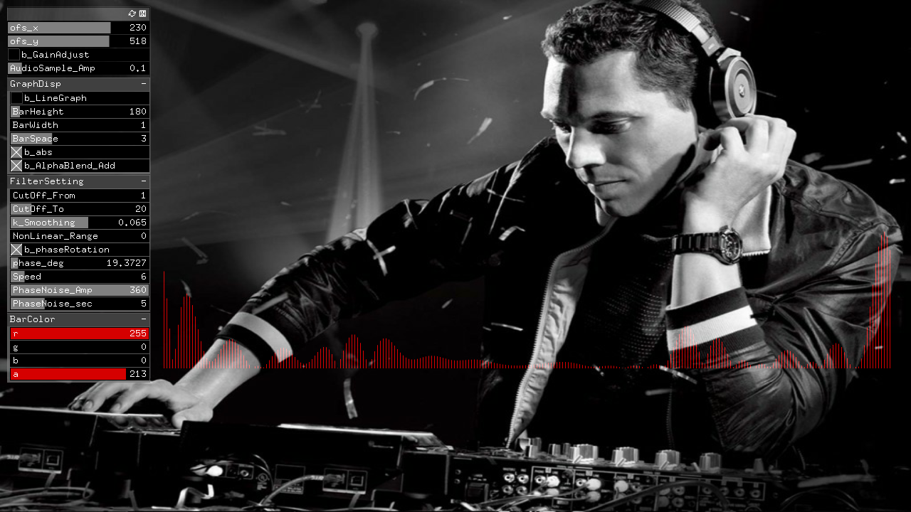

#work__AutoMagic_Director

##環境
*	OS X El Capitan(10.11.6)
*	Xcode : 7.2
*	oF : 0.9.0

##add on
ofxGui  
ofxXmlSettings  

##Contents
see also fft scratch on terminal.  
https://github.com/SJ-magic-study/study__fft_scratch  
  
Audio I/Fを通して入力された音楽に対して, fftを通し、Guiで指定された周波数成分を残してFilteringし、
phaseを揃えた上で時間軸に戻す。phaseを戻すのは、時間軸で表示する時にsin waveを綺麗に見せるため。  
  
Realtime動作.  

  

##Device
*	Audio I/F  
	Focusrite:Clarett 2Pre(thunderbolt model).  

##note

